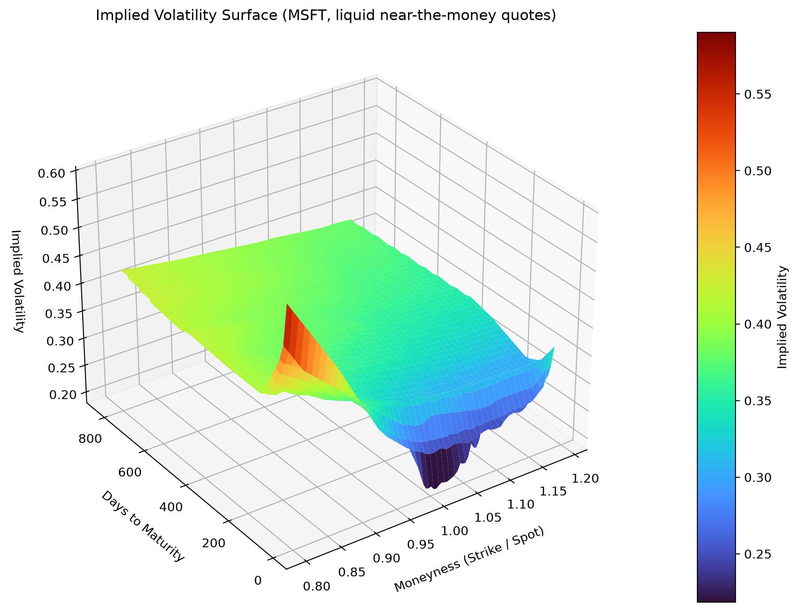

# Monte Carlo vs Quantum Option Pricing Simulation

A comparison of classical Monte Carlo simulation and a quantum computing
approach (Iterative Amplitude Estimation) for pricing a European call
option, using real market data for Microsoft (MSFT). The project also
builds a 3D implied volatility surface from live option chain data.

## Overview

This project prices a European call option on MSFT stock in two ways:

1. **Classical Monte Carlo simulation** — simulates 100,000 possible
   future stock price paths under a Geometric Brownian Motion (GBM)
   model and averages the discounted payoffs.
2. **Quantum amplitude estimation** — encodes the same log-normal price
   distribution into a quantum circuit and estimates the option payoff
   using the Iterative Amplitude Estimation (IAE) algorithm from Qiskit,
   simulated on a statevector simulator.

The two results are compared directly, including their respective 95%
confidence intervals.

In addition, the project pulls live option chain data for MSFT from
Yahoo Finance, filters it for liquidity (volume, open interest,
moneyness range), and interpolates it into a 3D **implied volatility
surface** — a genuine market-derived surface, not a synthetic model.

## Why this project

Quantum Amplitude Estimation is one of the more promising near-term
applications of quantum algorithms to finance: it can, in principle,
converge to an estimate with fewer samples than classical Monte Carlo
for a given target accuracy. This project is a hands-on comparison of
the two approaches on a real, if simple, pricing problem — using real
market data rather than toy/synthetic inputs throughout.

## How it works

### 1. Market data and volatility
- Downloads 1 year of MSFT daily closing prices via `yfinance`.
- Computes daily log returns and annualizes the volatility
  (`sigma = daily_volatility * sqrt(252)`).

### 2. Option setup
- Strike price = current stock price (at-the-money option).
- Time to maturity = 40 days.
- Risk-free rate = 5% (fixed assumption).

### 3. Classical Monte Carlo
- Simulates 100,000 future prices under GBM:
  `S_T = S_0 * exp((r - sigma²/2)·T + sigma·sqrt(T)·Z)`
- Computes the discounted payoff `max(S_T - K, 0)` for each path.
- Reports the mean price, standard error, and 95% confidence interval.

### 4. Quantum estimation
- Builds a `LogNormalDistribution` circuit (5 qubits) matching the
  same mean and variance as the Monte Carlo model.
- Uses `EuropeanCallPricing` from `qiskit-finance` to encode the payoff.
- Runs `IterativeAmplitudeEstimation` on a `StatevectorSampler`.
- Reports the estimated price and its confidence interval.

### 5. Implied volatility surface
- Pulls all available MSFT option expiration dates and their call
  option chains.
- Filters out illiquid or unreliable quotes:
  - `volume >= 10`
  - `open interest >= 50`
  - `moneyness` (strike / spot) between 0.8 and 1.2
  - `implied volatility` between 0 and 100%
- Interpolates the remaining data points onto a regular grid using
  `scipy.interpolate.griddata`.
- Plots the resulting 3D surface with `matplotlib`.

## Sample output

```
Ticker: MSFT
Current stock price: $499.7000
Strike price: $499.7000
Annualized volatility: 32.10%
Risk-free rate:  5.0 %
Monte Carlo
Payoff: $22.4572
Standard error: 0.1069
95% confidence interval: $22.25, $22.67
Quantum Model
Payoff: $21.8074
95% confidence interval: $20.99, $22.62
Comparison of methods
Absolute difference: $0.6497
Percentage difference: 2.89%
```

The Monte Carlo result closely matches the analytical Black-Scholes
price (~$22.49) for the same inputs. The quantum estimate differs by
about 2.9%, mainly due to the 5-qubit discretization of the price
distribution (32 discrete price levels) — increasing the qubit count
would narrow this gap at the cost of longer computation time.



## Requirements

- Python 3.10+
- [yfinance](https://pypi.org/project/yfinance/)
- numpy
- matplotlib
- scipy
- qiskit
- qiskit-finance
- qiskit-algorithms

## Installation

```bash
python -m venv .venv
source .venv/bin/activate  # on Windows: .venv\Scripts\activate
pip install yfinance numpy matplotlib scipy qiskit qiskit-finance qiskit-algorithms
```

## Usage

```bash
python main.py
```
This will print the pricing comparison to the console and save the
implied volatility surface as `Volatility_surface.png` in the project
directory.

## Known limitations

- The quantum model discretizes the price distribution into 2^5 = 32
  levels, limiting its precision relative to Monte Carlo; increasing
  `num_qubit` improves accuracy but increases runtime.
- The implied volatility surface depends on current option market
  liquidity; on days with few actively traded near-the-money contracts,
  the surface may be sparse or the script may raise an error asking to
  relax the liquidity filters.
- The risk-free rate and 40-day maturity are fixed assumptions rather
  than pulled from a live yield curve.

## Possible next steps

- Portfolio optimization via QAOA (quantum approximate optimization).
- Value-at-risk estimation using quantum amplitude estimation.
- Pricing exotic options (Asian, barrier) instead of vanilla European
  calls.
- Running the quantum circuit on real IBM Quantum hardware via
  `qiskit-ibm-runtime`, in addition to the local simulator.
